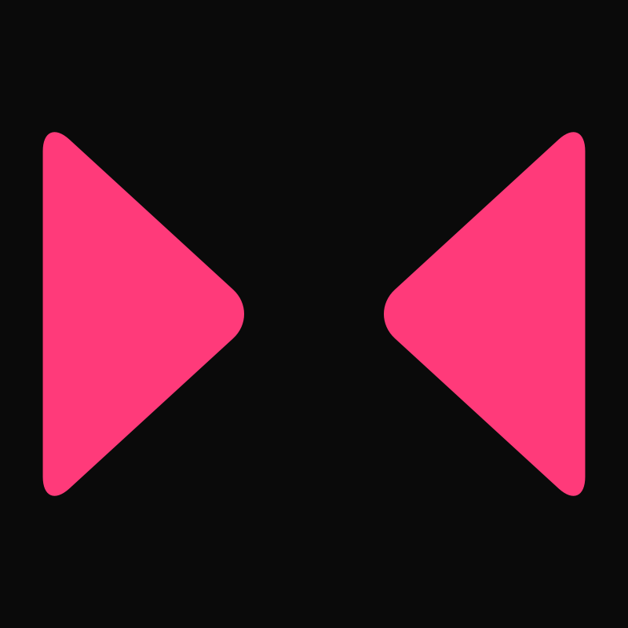

<div align="center">

# bezier-sdf

**Render SVG logos as GPU signed-distance fields, straight from cubic Bezier curves.**

Smooth animation, crisp at any zoom, no re-tessellation per frame.
WebGPU primary, WebGL fallback, static SVG when neither is available.



### [**→ Live demo**](https://axelwp.github.io/)

</div>

---

## Why

Every vector rendering library in the browser: SVG, Canvas, Pixi, Lottie, you name it, does roughly the same thing under the hood: take Bezier curves, triangulate them on the CPU, upload the triangles to the GPU, rasterize. It works, but it scales badly for animation. Every frame where the shape *changes* needs a fresh tessellation, a fresh upload, and a fresh rasterization. That's why a logo reveal animation in Lottie hits a budget that a static SVG doesn't.

This library takes the other path. The Bezier curves *are* the input to the GPU shader. The shader computes "distance from this pixel to the nearest point on any curve" directly. No triangles, no CPU tessellation, no intermediate mesh. The shape is a [signed distance field](https://iquilezles.org/articles/distfunctions2d/) defined by the curves themselves.

Two consequences:

- **Perfect anti-aliasing at any zoom.** An SDF tells you sub-pixel distance to the edge, so `fwidth`-based AA gives you an edge that's one pixel wide whether the logo is 32px or filling a 4K display.
- **Animation is free.** Re-rendering with a different transform is just "sample the texture at translated UVs and smooth-union." Your GPU can do 10,000 of those per frame without breathing hard.

The flip side: computing distance to a cubic Bezier is [non-trivial](https://iquilezles.org/articles/distfunctions2d/) (Newton-iterating on a quintic), so the naive shader is expensive. This library bakes each path's SDF into a texture *once* at init — the expensive step happens on the first frame, and every frame after that is a couple of texture samples. You get the animation flexibility without paying the per-pixel cost.

## Features

- **WebGPU renderer** for browsers that support it (Chrome/Edge 113+, Safari 26+, Firefox 141+ on desktop — about 70% of traffic as of 2026).
- **WebGL 1 renderer** as a universal fallback. Uses half-float render targets when available, falls back to a per-pixel shader if not.
- **SVG path parser** — feed it the `d` attribute of any `<path>`, get back a normalized array of cubic segments ready for the GPU. Supports `M/L/H/V/C/S/Q/T/Z` (everything Inkscape and Figma emit).
- **Canvas 2D helpers** for effects that want per-pixel control alongside the SDF: mask-based particle systems, animated stroke outlines, text clipped to the silhouette.
- **Polyline sampling** for shape-to-shape morphs — sample source and target at the same N points, interpolate, crossfade to exact Beziers for the final frames.
- **Monorepo** structured for extension: `@bezier-sdf/core` is framework-agnostic; a `@bezier-sdf/react` wrapper and `@bezier-sdf/cli` tool are obvious next additions.

## Repo layout

```
bezier-sdf/
├── packages/
│   └── core/              ← the library (@bezier-sdf/core)
│       ├── src/
│       │   ├── geometry/  ← types, SVG parser, sampling, demo mark
│       │   ├── renderers/ ← WebGPU + WebGL renderer classes
│       │   ├── shaders/   ← WGSL + GLSL source as string constants
│       │   └── canvas/    ← Canvas 2D helpers (masks, perturbation)
│       └── README.md      ← per-package docs / npm-facing
├── examples/              ← standalone Vite apps demonstrating features
│   ├── reveal/            ← the split-morph intro animation
│   ├── fan/               ← breathing outline swarm
│   ├── cipher/            ← hex-glyph rain clipped to silhouette
│   ├── root-system/       ← tendrils wrapping the shape
│   └── morph/             ← shape-to-shape morph (source ≠ target)
├── docs/                  ← technique writeup, performance notes
└── skill/                 ← SKILL.md + templates for Claude integration
```

## Install and run

Requires [pnpm](https://pnpm.io/) and Node 18+.

```bash
pnpm install          # install everything
pnpm build            # build all packages
pnpm dev:examples     # run every example in parallel
```

Or run a single example:

```bash
pnpm --filter @bezier-sdf/example-reveal dev
```

## Using the library

```bash
npm install @bezier-sdf/core
```

Minimal example — draw the default demo mark on a canvas:

```ts
import { createRenderer, DEMO_MARK } from '@bezier-sdf/core';

const canvas = document.querySelector<HTMLCanvasElement>('#logo')!;
canvas.width = 800;
canvas.height = 800;

const { renderer } = await createRenderer('auto', {
  canvas,
  mark: DEMO_MARK,
});

renderer.render({
  width: canvas.width,
  height: canvas.height,
  zoom: 1, offsetX: 0, offsetY: 0,
  pathOffsets: [[0, 0], [0, 0]],
  sminK: 0.08,
  color: [1, 0.23, 0.48],
  opacity: 1,
});
```

Your own logo:

```ts
import { createRenderer, parseSvgPath, normalizeMark } from '@bezier-sdf/core';

// The `d` attribute of your <path> element, from Inkscape's Plain SVG export.
const raw = parseSvgPath('M 297 790 C -35 -10, ... Z M 518 790 C -46 -9, ... Z');
const { mark } = normalizeMark(raw); // center + scale into [-1, 1]

const { renderer } = await createRenderer('auto', { canvas, mark });
// ... render as above, one [x, y] offset per mark.paths entry
```

See [`packages/core/README.md`](./packages/core/README.md) for the full API, and [`examples/`](./examples) for runnable integration demos.

## Examples

Each folder under [`examples/`](./examples) is a standalone Vite app that depends on `@bezier-sdf/core` via the workspace link — edit a core file, the example hot-reloads.

<div align="center">

https://github.com/user-attachments/assets/79373986-fb38-4aac-8bc8-e926ca45585c

<sub><code>examples/reveal</code> — run with <code>pnpm --filter @bezier-sdf/example-reveal dev</code></sub>

</div>

| Example         | Technique                                                              |
|-----------------|------------------------------------------------------------------------|
| `reveal`        | Split-morph intro: sub-paths start merged, slide to final positions on scroll-into-view |
| `fan`           | A swarm of perturbed outlines, additively blended into a "many outcomes" shape |
| `cipher`        | Grid of falling hex glyphs clipped to the silhouette, terminal-like  |
| `root-system`   | Tendrils grow inward from canvas edges, deflecting along the outline |
| `morph`         | Interpolate between two traced logos using polyline sampling + crossfade |

## Performance

Measured on a 2023 M1 MacBook at 1024×1024, 26 cubic segments total:

| Mode                 | First frame (bake) | Subsequent frames |
|----------------------|-------------------:|------------------:|
| WebGPU baked         | ~8ms              | ~0.5ms            |
| WebGL baked          | ~14ms             | ~1.1ms            |
| WebGL direct (fallback) | n/a            | ~3.2ms            |

The bake step is a one-time cost at init. Every frame after that is dominated by texture sampling and smooth-min, well under one vblank even at 4K resolution.

See [`docs/performance.md`](./docs/performance.md) for the full methodology and comparisons to SVG, Canvas, and Lottie equivalents.

## Seen in the wild

This library powers the logo reveal on [levx.trade](https://levx.trade) *(replace with your site)* — a chart-line-to-logo morph that demonstrates the polyline sampling pattern in production. Source is closed but the technique is documented in [`docs/technique.md`](./docs/technique.md#the-chart-to-logo-morph-pattern).

## Contributing

Pull requests welcome, particularly:

- Additional SVG command support (`A` arc conversion via cubic approximation)
- Vue / Svelte / Solid bindings as `@bezier-sdf/<framework>` packages
- More renderer backends (canvas-based offscreen 2D for testing)

## License

MIT. See [LICENSE](./LICENSE).
